# Threat Hunt Report - Signals After the Noise

**Case:** PHTG-INC-2025-1213 · PHTG HealthCloud // Cyber Range SOC
**Platform:** Windows estate (azwks-phtg-01)
**Window:** 13 December 2025, 09:00-18:00 UTC (investigation window), anchor 09:48 UTC


---

## 1. Complete Scenario

### Summary

Someone got into the PHTG HealthCloud estate, and the break-in itself was already settled. What the operator did once inside was not, and nearly all of it looked like routine administration. The lead-up showed failed logons from several regions before a success, which reads as brute force, but the credential material tied back to the same account: this was credential reuse. The vmadminusername account then landed on azwks-phtg-01 from the internal address 10.0.0.152, and there was no onward movement beyond that host. The operator launched a first script from the user's Documents folder, ran it hidden and with the execution policy bypassed, and stood up a staging workspace under C:\ProgramData\PHTG\HealthCloud, hiding artefacts across its Cache and TempCache directories with attrib. A binary named PHTGHealthCloudSvc.exe masqueraded as bitsadmin.exe and ran a healthcheck loop, while two encoded PowerShell beacons called out to status.health-cloud.cc. Persistence went in three ways: a Run key, a shortcut in the Startup folder, and a custom Application event log source registered under HKLM so the tooling could write into a trusted log. The operator then quieted Defender with path and process exclusions, added and removed a temporary exclusion inside `_.ps1`, and broke process lineage by routing payloads through cmd.exe. Defender detected the persistence artefact but did not block it. The chain ended at the vault: powershell.exe under vmadminusername opened a full-access handle to LSASS, and the follow-on memory read confirmed credential dumping. Overall, this is **credential reuse, host-level persistence, layered defence handling, and LSASS credential access**, carried out largely through native tooling and one masqueraded binary.

---

**// HUNT ASSIGNMENT // PHTG HealthCloud**

> **From: Hunt Lead // Cyber Range SOC**
>
> **To: Threat Hunter // On-Shift**
>
> Re: PHTG HealthCloud // post-intrusion hunt
>
> Someone got into the estate. The break-in itself is established. What the operator did once inside is not. That is this hunt.
>
> The lead-up is known. The aftermath is not. Between the morning of 13 December and that evening, the operator was on the estate doing work, and nearly all of it looked like routine administration.
>
> Your job is to reconstruct what happened after access. Not to confirm the break-in, that is settled. To map what the operator touched, what they stood up to stay resident, how they talked out, and what they reached for at the end.
>
> What we do not yet know: the initial access vector, which is not yet established · what persisted, and whether it is still resident · how the operator's tooling phoned home · what the operator reached for at the end of the chain.
>
> **// Hunt Lead, Cyber Range Operations**

---

### Live Announcement

> 🔵 **HUNT 06 // SIGNALS AFTER THE NOISE 2 // ACTIVE**

> The break-in is settled. The aftermath is not. One operator, one host, a working day of activity that mostly reads as routine administration.
>
> Do not inherit assumptions from the lead-up. Let the telemetry settle each question.
>
> Difficulty: **Intermediate**
>
> Flags: **29** // gate + 7 phases

---

### How To Hunt This [method, not answers]

A post-access hunt: the value is in spotting deliberate intent inside ordinary-looking activity.

**01** Anchor on the moment access began. The window opens at 09:00 UTC, but the anchor is 09:48. Work forward from the anchor, not from the lead-up.

**02** Do not inherit assumptions. A pile of failed logons looks like brute force until you test it against what actually succeeded.

**03** Discover the schema yourself. Run `take 1` or `getschema` first, because field names are not always what you would expect.

**04** Match the table to the noun. Logons, process execution, file activity, registry changes, and process-level API calls each live in their own table.

**05** Separate the human from the housekeeping. Most registry, file, and process activity is Windows tidying up. Filter by account and initiating process before you read rows.

**06** Decode before you conclude. Encoded commands hide their real destinations until you decode them.

**07** Configured is not fired, and detected is not blocked. Confirm what persistence actually executed and what the defences actually did.

**08** Aggregate and correlate. The single loud answer is rarely the one that matters.

---

## 2. Objective

Reconstruct the PHTG HealthCloud post-intrusion activity end to end:

- Test the brute-force assumption and establish the real access vector
- Trace the lateral movement onto the host and prove whether the operator moved any further
- Reconstruct the operator's first scripts, staging workspace, and concealment methods
- Identify every persistence mechanism and confirm which ones actually fired
- Map the operator's outbound activity, including encoded beacons and the download-then-execute pattern
- Establish how the operator handled the host's defences, and what Defender did about it
- Identify what the operator reached for at the end of the chain

---

## 3. Tools & Technologies

| Tool / Technology | Role in the Hunt |
|---|---|
| Microsoft Sentinel | Central query surface: `LAW-Cyber-Range` workspace |
| Microsoft Defender for Endpoint (MDE) | Source telemetry for logon, process, file, registry, and device events |
| KQL | Query language used across all MDE tables |
| DeviceLogonEvents | Authentication: successful logons, source IP, lateral movement |
| DeviceProcessEvents | Process/command-line activity: scripts, masquerading, beacons, lineage |
| DeviceFileEvents | File activity tied to staging and Startup-folder persistence |
| DeviceRegistryEvents | Run keys, event log source registration, Defender exclusions |
| DeviceEvents | Process-level API calls against LSASS, antivirus reports |
| Windows host | azwks-phtg-01 |

---

## 4. Flags

### Phase 01: Cold Trail

### 🚩 Flag 1: The Brute Force Assumption

**What to find:** The lead-up logged failed logons from several regions before the successful one. Easy to call it brute force and move on. Test that assumption: if the successful access was not brute force, what was the actual vector? Give a short technical phrase, two words, specific to what the telemetry shows about the credentials and the login.

| Field | Value |
|---|---|
| **Answer** | credential reuse |
| **Time (UTC)** | N/A |

**Details:** Examining the successful logon against the failed-logon volume from the lead-up showed the credential material tying back to the same account, indicating the actual access vector was credential reuse rather than brute force.

**Query:**
```kql
DeviceLogonEvents
| where TimeGenerated between (datetime(2025-12-13 09:48:00) .. datetime(2025-12-13 18:00:00))
| where ActionType == "LogonSuccess"
| where AccountDomain contains "phtg"
| project-reorder TimeGenerated, AccountName, AccountDomain,DeviceName, LogonId, RemoteIP, InitiatingProcessCommandLine, *
```

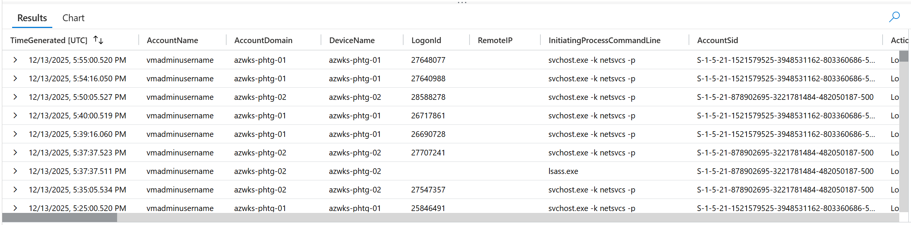

---

### 🚩 Flag 2: Lateral Movement Summary

**What to find:** Once the operator was in, they moved onto the host under review. Give the account used, the internal source it authenticated from, and the target host it landed on.

| Field | Value |
|---|---|
| **Answer** | vmadminusername, 10.0.0.152, azwks-phtg-01 |
| **Time (UTC)** | 2025-12-13T09:48:34.2774069Z |

**Details:** Reviewing successful logons on the PHTG estate from 09:48 UTC onward identified the lateral movement fingerprint: the vmadminusername account authenticating from internal source 10.0.0.152 and landing on target host azwks-phtg-01.

**Query:**
```kql
DeviceLogonEvents
| where TimeGenerated between (datetime(2025-12-13 09:48:00) .. datetime(2025-12-13 18:00:00))
| where ActionType == "LogonSuccess"
| where AccountDomain contains "phtg"
| project-keep TimeGenerated, AccountName, AccountDomain,DeviceName, LogonId, InitiatingProcessCommandLine, RemoteIP
| order by TimeGenerated asc
```

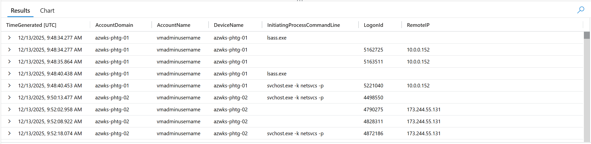

---

### 🚩 Flag 3: Onward Movement Check

**What to find:** A landing isn't the end of the path. Check whether the operator moved on from the secondary host to anything else, and prove it either way.

| Field | Value |
|---|---|
| **Answer** | None |
| **Time (UTC)** | 2025-12-13T09:48:40.4531646Z |

**Details:** Checking DeviceLogonEvents across the fleet using the secondary host's IP as source returned no further onward pivots, confirming the operator did not move beyond azwks-phtg-01 to any additional hosts.

**Query:**
```kql
DeviceLogonEvents
| where TimeGenerated between (datetime(2025-12-13 09:48:00) .. datetime(2025-12-13 18:00:00))
| where ActionType == "LogonSuccess"
| where AccountDomain contains "phtg"
| where RemoteIP == "10.0.0.152"
| project-keep TimeGenerated, AccountName, AccountDomain,DeviceName, LogonId, InitiatingProcessCommandLine, RemoteIP
| order by TimeGenerated asc
```

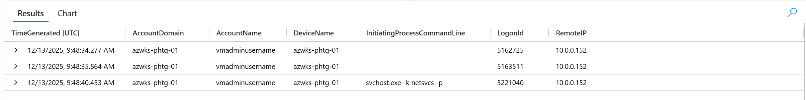

---

### Phase 02: First Footsteps

### 🚩 Flag 4: First Operator Script

**What to find:** After the lateral movement, the operator launched their first script. Give the full path of that script.

| Field | Value |
|---|---|
| **Answer** | C:\Users\vmAdminUsername\Documents\PHTG_.ps1 |
| **Time (UTC)** | 2025-12-13T10:11:43.2936291Z |

**Details:** Filtering DeviceFileEvents on azwks-phtg-01 for PowerShell-initiated activity under the operator's account context identified the first script launched after lateral movement, at the given path.

**Query:**
```kql
DeviceFileEvents
| where TimeGenerated between (datetime(2025-12-13 09:48:00) .. datetime(2025-12-13 18:00:00))
| where InitiatingProcessAccountDomain == "azwks-phtg-01"
| where InitiatingProcessCommandLine contains "powershell"
| project-reorder TimeGenerated, DeviceName, InitiatingProcessCommandLine, *
| order by TimeGenerated asc
```

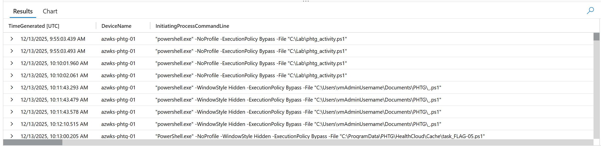

---

### 🚩 Flag 5: Operator Concealment Flags

**What to find:** Look at the command line that launched that first script. Give the launch command, including the switches that show the operator meant to run silently and around default script restrictions.

| Field | Value |
|---|---|
| **Answer** | "PowerShell.exe" -NoProfile -WindowStyle Hidden -ExecutionPolicy Bypass -File "C:\ProgramData\PHTG\HealthCloud\Cache\task_FLAG-16.ps1" "PowerShell.exe" -NoProfile -WindowStyle Hidden -ExecutionPolicy Bypass -File "C:\ProgramData\PHTG\HealthCloud\Cache\task_FLAG-05.ps1" |
| **Time (UTC)** | 2025-12-13T10:13:00.2055436Z |

**Details:** Reviewing the command line that invoked the Flag 4 script surfaced -NoProfile and -WindowStyle Hidden alongside -ExecutionPolicy Bypass, flags signaling deliberate operator intent to run silently and evade default script-restriction policy.

**Query:** Same as Flag 4

---

### 🚩 Flag 6: Operator Tooling Workspace

**What to find:** The operator staged their tooling under a parent path in ProgramData. Give the working directory they used.

| Field | Value |
|---|---|
| **Answer** | C:\ProgramData\PHTG\HealthCloud |
| **Time (UTC)** | 2025-12-13T10:13:00.2055436Z |

**Details:** Filtering file activity referencing the C:\ProgramData\PHTG parent path identified C:\ProgramData\PHTG\HealthCloud as the operator's staged workspace directory, with Bin, Cache, and TempCache confirmed as its working subdirectories.

**Query:**
```kql
DeviceFileEvents
| where TimeGenerated between (datetime(2025-12-13 09:48:00) .. datetime(2025-12-13 18:00:00))
| where InitiatingProcessAccountDomain == "azwks-phtg-01"
| where InitiatingProcessCommandLine contains "C:\\ProgramData\\PHTG"
| project-reorder TimeGenerated, DeviceName, InitiatingProcessCommandLine, *
| order by TimeGenerated asc
```

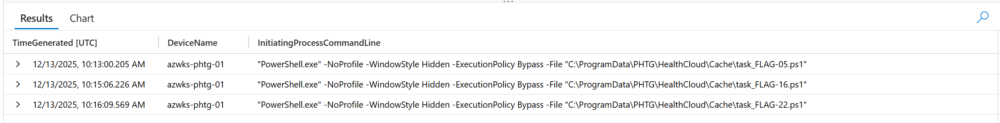

---

### 🚩 Flag 7: Concealment Pattern

**What to find:** The operator used attrib to hide artefacts across the HealthCloud workspace. Two top-level staging directories took the bulk of the hiding. Name both, give the count of attribute modifications bucketed to each, and say which got the heavier treatment.

| Field | Value |
|---|---|
| **Answer** | TempCache Cache, 3 and 17, Cache |
| **Time (UTC)** | N/A |

**Details:** Grouping attrib.exe invocations with +h or +s flags on azwks-phtg-01 by top-level directory under HealthCloud showed TempCache and Cache as the two staging directories targeted, with 3 attribute modifications against TempCache and 17 against Cache, confirming Cache received the heavier concealment treatment.

**Query:**
```kql
DeviceProcessEvents
| where TimeGenerated > datetime(2025-12-13 09:48:00)
| where DeviceName == "azwks-phtg-01"
| where FileName =~ "attrib.exe"
| where ProcessCommandLine has_any ("+h", "+s")
| extend SubDirectory = case(
    ProcessCommandLine contains @"C:\ProgramData\PHTG\HealthCloud\Cache", "Cache",
    ProcessCommandLine contains @"C:\ProgramData\PHTG\HealthCloud\TempCache", "TempCache",
    "Other"
)
| summarize count() by SubDirectory
```

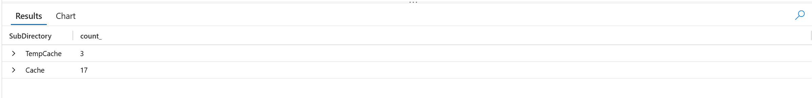

---

### 🚩 Flag 8: LOLBin Masquerade Identification

**What to find:** Several processes on the host show FileName different to OriginalFileName: Edge update, TSTheme, wlrmdr, PhoneExperienceHost, all legitimate. One is operator tooling. Name the executable, name what it claims to be, and explain how you separated it from the noise.

| Field | Value |
|---|---|
| **Answer** | PHTGHealthCloudSvc.exe masqueraded as bitsadmin.exe |
| **Time (UTC)** | N/A |

**Details:** Filtering DeviceProcessEvents on azwks-phtg-01 for FileName/OriginalFileName mismatches under the operator's account, separated from legitimate Windows renaming (Edge update, TSTheme, wlrmdr, PhoneExperienceHost), identified PHTGHealthCloudSvc.exe as operator tooling masquerading as bitsadmin.exe, carrying campaign-specific markers absent from the genuine mismatches.

**Query:**
```kql
DeviceProcessEvents
| where TimeGenerated between (datetime(2025-12-13 09:48:00) .. datetime(2025-12-13 18:00:00))
| where DeviceName == "azwks-phtg-01"
| where AccountName == "vmadminusername"
| where isnotempty(FileName)
| where isnotempty(ProcessVersionInfoOriginalFileName)
| where FileName !~ ProcessVersionInfoOriginalFileName
| project FileName, ProcessVersionInfoOriginalFileName
```

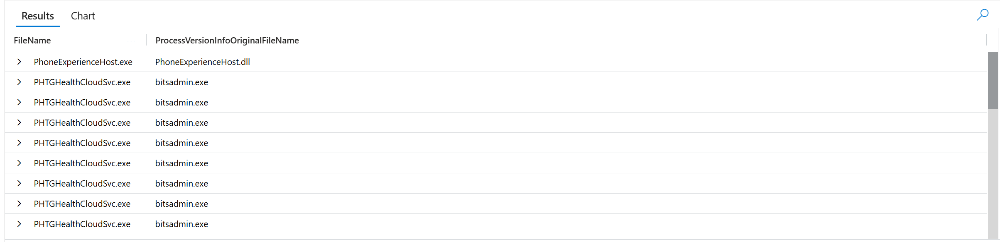

---

### Phase 03: Quiet Roots

### 🚩 Flag 9: Registry Activity Volume

**What to find:** Volume check. How many registry modification events fired under vmadminusername on the host after lateral movement?

| Field | Value |
|---|---|
| **Answer** | 280 |
| **Time (UTC)** | N/A |

**Details:** Counting DeviceRegistryEvents on azwks-phtg-01 under vmadminusername after the 09:48:40Z anchor moment returned 280 registry modification events fired post-lateral movement.

**Query:**
```kql
DeviceRegistryEvents
| where DeviceName == "azwks-phtg-01"
| where InitiatingProcessAccountName == "vmadminusername"
| where TimeGenerated > datetime(2025-12-13T09:48:40Z)
| count
```

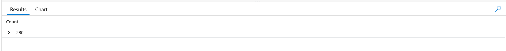

---

### 🚩 Flag 10: Persistence Signal Isolation

**What to find:** Somewhere in that registry volume sits the one path that matters for persistence. Cut past the housekeeping noise and give the registry path.

| Field | Value |
|---|---|
| **Answer** | HKEY_CURRENT_USER\S-1-5-21-1521579525-3948531162-803360686-500\SOFTWARE\Microsoft\Windows\CurrentVersion\Run |
| **Time (UTC)** | N/A |

**Details:** Filtering the 280 registry events down to PowerShell-initiated activity, past the Desktop theme, MUI cache, and COM CLSID housekeeping noise, isolated the classic Run-key registry path as the persistence mechanism that actually mattered.

**Query:**
```kql
DeviceRegistryEvents
| where DeviceName == "azwks-phtg-01"
| where InitiatingProcessAccountName == "vmadminusername"
| where TimeGenerated > datetime(2025-12-13T09:48:40Z)
| where InitiatingProcessCommandLine contains "powershell"
| project RegistryKey, InitiatingProcessCommandLine
```

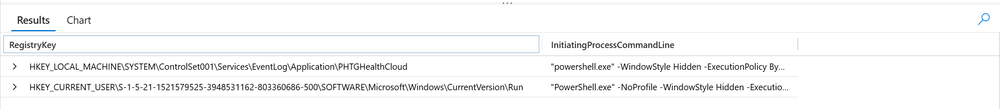

---

### 🚩 Flag 11: Run Key Value Name

**What to find:** The Run key from Flag 10 carries multiple values. Edge auto-launch is legitimate. The operator's isn't. Which value name points to their tooling?

| Field | Value |
|---|---|
| **Answer** | PHTGHealthCloudTray |
| **Time (UTC)** | N/A |

**Details:** Summarizing the Run key's values by RegistryValueName and RegistryValueData showed the legitimate Edge auto-launch entry alongside a distinct value, PHTGHealthCloudTray, pointing to the operator's own persistence tooling.

**Query:**
```kql
DeviceRegistryEvents
| where DeviceName == "azwks-phtg-01"
| where InitiatingProcessAccountName == "vmadminusername"
| where TimeGenerated > datetime(2025-12-13T09:48:40Z)
| where RegistryKey contains @"HKEY_CURRENT_USER\S-1-5-21-1521579525-3948531162-803360686-500\SOFTWARE\Microsoft\Windows\CurrentVersion\Run"
| summarize Events=count() by RegistryValueName, RegistryValueData
```

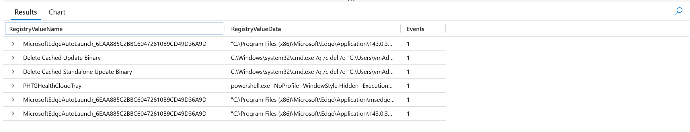

---

### 🚩 Flag 12: Run Key Persistence Command

**What to find:** That Run key value carries the full command that fires at logon. Give it.

| Field | Value |
|---|---|
| **Answer** | powershell.exe -NoProfile -WindowStyle Hidden -ExecutionPolicy Bypass -File "C:\ProgramData\PHTG\HealthCloud\Bin\HealthCloudTray.ps1" |
| **Time (UTC)** | N/A |

**Details:** The RegistryValueData for the PHTGHealthCloudTray Run key value carried the full logon-persistence command, launching a hidden, execution-policy-bypassed PowerShell process against the operator's staged script in the Bin subdirectory.

**Query:** Same as Flag 11

---

### 🚩 Flag 13: Second Persistence Mechanism

**What to find:** The Run key isn't the operator's only persistence. They dropped a second mechanism in a Windows folder that runs at logon. Find the artefact, filename with extension.

| Field | Value |
|---|---|
| **Answer** | PHTG HealthCloud.lnk |
| **Time (UTC)** | 2025-12-13T10:13:00.2055436Z |

**Details:** Filtering DeviceFileEvents on azwks-phtg-01 for activity under the Startup folder path identified a second persistence artefact, PHTG HealthCloud.lnk, dropped in the Windows Startup folder to run at logon alongside the Run-key mechanism.

**Query:**
```kql
DeviceFileEvents
| where DeviceName == "azwks-phtg-01"
| where InitiatingProcessAccountName =~ "vmadminusername"
| where TimeGenerated > datetime(2025-12-13T09:48:40Z)
| where FolderPath contains @"\Start Menu\Programs\Startup"
| project TimeGenerated, ActionType, FileName, FolderPath,
          InitiatingProcessFileName, InitiatingProcessCommandLine
| order by TimeGenerated asc
```

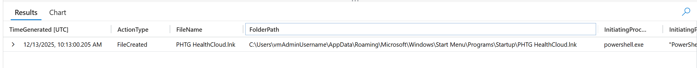

---

### 🚩 Flag 14: Third Persistence Mechanism

**What to find:** The operator made a system-level (HKLM) registry change that gave their tooling a specific capability: writing into a trusted Windows log. This is not scheduled-task persistence and not Defender tampering. Identify this key path.

| Field | Value |
|---|---|
| **Answer** | HKEY_LOCAL_MACHINE\SYSTEM\ControlSet001\Services\EventLog\Application\PHTGHealthCloud |
| **Time (UTC)** | 2025-12-13T10:11:43.598688Z |

**Details:** Filtering DeviceRegistryEvents on azwks-phtg-01 for keys referencing EventLog identified a system-level HKLM registry change registering PHTGHealthCloud under the EventLog\Application key, granting the operator's tooling the capability to write into a trusted Windows log.

**Query:**
```kql
DeviceRegistryEvents
| where TimeGenerated > datetime(2025-12-13T09:48:40Z)
| where DeviceName == "azwks-phtg-01"
| where RegistryKey contains "EventLog"
| project TimeGenerated, ActionType, RegistryKey, RegistryValueName, RegistryValueData,
          InitiatingProcessAccountName, InitiatingProcessCommandLine
| order by TimeGenerated asc
```

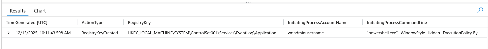

---

### Phase 04: The Beacon Pair

### 🚩 Flag 15: Tooling Healthcheck Loop

**What to find:** The masquerade binary from Flag 8 ran on a loop. Count how many times it executed under the operator's account across the post-access window.

| Field | Value |
|---|---|
| **Answer** | 22 |
| **Time (UTC)** | N/A |

**Details:** Counting executions of the PHTGHealthCloudSvc.exe masquerade binary under vmadminusername on azwks-phtg-01 across the post-access window returned 22 healthcheck loop executions.

**Query:**
```kql
DeviceProcessEvents
| where TimeGenerated between (datetime(2025-12-13 09:48:00) .. datetime(2025-12-13 18:00:00))
| where DeviceName == "azwks-phtg-01"
| where AccountName == "vmadminusername"
| where FileName == "PHTGHealthCloudSvc.exe"
| count
```

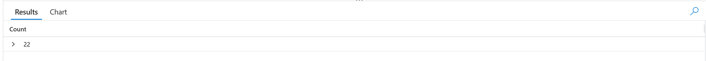

---

### 🚩 Flag 16: Encoded Beacon Endpoints

**What to find:** Alongside the healthcheck loop, the operator fired two encoded PowerShell beacons. Decode both. What endpoints did they contact? Report both in chronological order, with the parent domain.

| Field | Value |
|---|---|
| **Answer** | https://status.health-cloud.cc/api/checkin?flag=FLAG-09&device=azwks-phtg-01 and https://status.health-cloud.cc/api/status?flag=FLAG-10&device=azwks-phtg-01; parent domain: health-cloud.cc |
| **Time (UTC)** | 2025-12-13T10:13:43.5081208Z |

**Details:** Decoding the base64-encoded PowerShell payloads (UTF-16LE) launched alongside the SvcExe healthcheck loop revealed two beacons, in chronological order contacting the checkin and status endpoints under the health-cloud.cc parent domain, both tagged with the device identifier.

**Query:**
```kql
DeviceProcessEvents
| where DeviceName == "azwks-phtg-01"
| where FileName =~ "powershell.exe"
| where ProcessCommandLine has "-EncodedCommand"
| where TimeGenerated between (
    datetime(2025-12-13T09:48:40Z) ..
    datetime(2025-12-13T18:00:00Z)
)
| extend EncodedBlob = extract(@"(?i)-EncodedCommand\s+([A-Za-z0-9+/=]+)",1,ProcessCommandLine)
| extend Decoded = base64_decode_tostring(EncodedBlob)
| project TimeGenerated, ProcessCommandLine, Decoded
| order by TimeGenerated asc
```

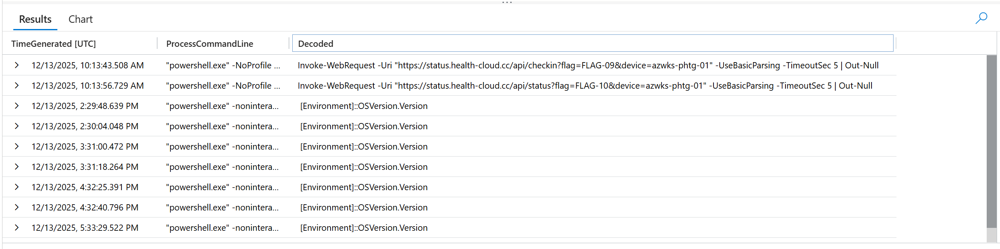

---

### 🚩 Flag 17: Two Beacons, Why?

**What to find:** Two parallel beacon mechanisms ran during the operator session. Reasoning, not extraction: what does running two channels in parallel buy the operator? Cover both the resilience benefit and the detection benefit.

| Field | Value |
|---|---|
| **Answer** | Running two beacon channels provides resilience because one can maintain communications if the other is blocked or detected, while splitting traffic across channels reduces the concentration of a single detectable beaconing pattern. |
| **Time (UTC)** | N/A |

**Details:** Reasoning over the SvcExe healthcheck loop and the encoded PowerShell beacons running in parallel showed the dual-channel design gave the operator redundancy against detection/blocking of either channel, while also thinning the volume and consistency of traffic on any single channel, making the beaconing pattern harder for defenders to isolate.

**Query:** N/A

---

### Phase 05: Outbound Whispers

### 🚩 Flag 18: Deployment Pattern Recognition

**What to find:** Two actions sit one second apart in the operator's outbound activity: an outbound action, then a tool launch. Describe the deployment pattern they form.

| Field | Value |
|---|---|
| **Answer** | The first action downloads a file from updates.health-cloud.cc, and the second step runs that downloaded file. |
| **Time (UTC)** | N/A |

**Details:** The one-second gap between the 10:12:16 outbound action and the 10:12:17 tool launch showed a classic download-then-execute deployment pattern: the operator's first step pulled a file from the C2 infrastructure, and the second step immediately executed the retrieved payload.

**Query:** N/A

---

### 🚩 Flag 19: Operator Outbound Domains

**What to find:** Review the operator's PowerShell outbound activity after access. Name the two domains contacted, in chronological order.

| Field | Value |
|---|---|
| **Answer** | updates.health-cloud.cc, status.health-cloud.cc |
| **Time (UTC)** | N/A |

**Details:** Reviewing the operator's PowerShell outbound activity during post-access identified two domains contacted in chronological order, both resolving under the health-cloud.cc parent infrastructure.

**Query:** N/A

---

### 🚩 Flag 20: AMSI Probe Identification

**What to find:** After outbound succeeded, the operator ran a plain (non-encoded) PowerShell script from their staging Bin directory. Name the script and explain what it's doing.

| Field | Value |
|---|---|
| **Answer** | amsi_probe.ps1 and this script is probing the OS's AMSI to measure it's detection capabilities. |
| **Time (UTC)** | 2025-12-13T10:14:10.495843Z |

**Details:** After outbound communication succeeded, the operator ran a plain (non-encoded) PowerShell script from the staging Bin directory. The script, amsi_probe.ps1, probed the host's Antimalware Scan Interface to gauge the OS's detection capabilities before running the main payload.

**Query:**
```kql
DeviceProcessEvents
| where TimeGenerated between (datetime(2025-12-13T09:48:40Z) .. datetime(2025-12-13T18:00:00Z))
| where AccountDomain == "azwks-phtg-01"
| where AccountName =="vmadminusername"
| where ProcessCommandLine has "Bin"
| where FileName =~ "powershell.exe"
| project-reorder TimeGenerated, FolderPath, ProcessCommandLine, *
| order by TimeGenerated asc
```

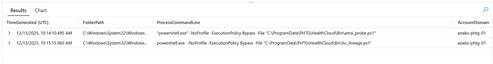

---

### Phase 06: Doors Held Open

### 🚩 Flag 21: Lineage Break Pattern

**What to find:** Inside the first hour, two follow-on payloads were loaded through cmd.exe rather than launched directly. Name both files, and explain why the operator routed them that way.

| Field | Value |
|---|---|
| **Answer** | hc_lineage.ps1, phtg_health_diag_update_FLAG-22.bat, the files were broken down to avoid detection |
| **Time (UTC)** | 2025-12-13T10:15:15.0962797Z |

**Details:** Filtering cmd.exe activity under vmadminusername on azwks-phtg-01 within the first hour after the anchor logon, excluding whoami events, showed two follow-on payloads, hc_lineage.ps1 and phtg_health_diag_update_FLAG-22.bat, loaded directly by cmd.exe as arguments. Routing them through cmd.exe broke the process lineage, obscuring the parent-child process tree to avoid detection.

**Query:**
```kql
DeviceProcessEvents
| where TimeGenerated between (datetime(2025-12-13T09:48:40Z) .. datetime(2025-12-13T10:48:00Z))
| where AccountDomain == "azwks-phtg-01"
| where AccountName =="vmadminusername"
| where FileName =~ "cmd.exe"
| where ProcessCommandLine !has "whoami"
| project-reorder TimeGenerated, FolderPath, ProcessCommandLine, *
| order by TimeGenerated asc
```

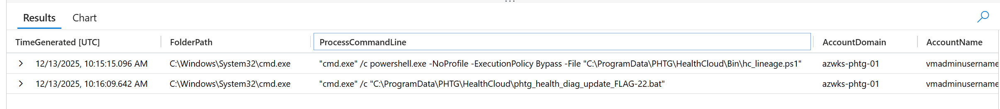

---

### 🚩 Flag 22: Defender Tampering

**What to find:** The operator made Defender quieter after persistence landed. What did they exclude? List both objects: one is a path, one is a process.

| Field | Value |
|---|---|
| **Answer** | The Defender exclusions were the path C:\ProgramData\PHTG\HealthCloud\Cache and the process C:\ProgramData\PHTG\HealthCloud\PHTGHealthCloudSvc.exe |
| **Time (UTC)** | 2025-12-13T10:12:18.6819419Z |

**Details:** Filtering DeviceRegistryEvents on azwks-phtg-01 for changes under the Windows Defender Exclusions key showed the operator quieted Defender after persistence landed by excluding the operator's Cache staging path and the PHTGHealthCloudSvc.exe process residing in the HealthCloud directory.

**Query:**
```kql
DeviceRegistryEvents
| where TimeGenerated between (datetime(2025-12-13 09:48:00) .. datetime(2025-12-13 18:00:00))
| where DeviceName == "azwks-phtg-01"
| where RegistryKey contains "Windows Defender\\Exclusions"
| project TimeGenerated, RegistryKey, RegistryValueName, RegistryValueData,
          InitiatingProcessAccountName, InitiatingProcessCommandLine
| order by TimeGenerated asc
```

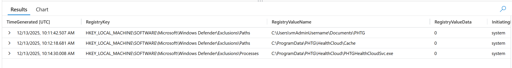

---

### 🚩 Flag 23: Defender Detection Outcome

**What to find:** Defender generated two AntivirusReport events on the PHTG HealthCloud.lnk artefact. Did it block the persistence? What does WasExecutingWhileDetected tell you about defensive posture?

| Field | Value |
|---|---|
| **Answer** | Defender detected and generated two AntivirusReport events for PHTG HealthCloud.lnk, but it did not block the persistence; WasExecutingWhileDetected=false indicates the artefact was not executing when detected and therefore remained in place. |
| **Time (UTC)** | N/A |

**Details:** Defender generated two AntivirusReport events on the PHTG HealthCloud.lnk artefact, confirming detection. However, the persistence was not blocked: WasExecutingWhileDetected was false, meaning the artefact was not executing at detection time, so it remained in place and Defender's posture was detect-only rather than preventive.

**Query:** N/A

---

### 🚩 Flag 24: Temporary Defender Exclusion

**What to find:** Inside `_.ps1` itself the operator did something neat with Defender: applied an exclusion, then removed it within seconds. Identify the path briefly excluded, prove the add-then-remove pattern, and explain why an operator does this.

| Field | Value |
|---|---|
| **Answer** | The temporarily excluded path was C:\Users\vmAdminUsername\Documents\PHTG; `_.ps1` added the Defender exclusion and removed it again within seconds, temporarily suppressing Defender inspection of the staging area while the operator executed their tooling and then removing the exclusion to restore the original defensive state. |
| **Time (UTC)** | N/A |

**Details:** Inside `_.ps1`, the operator applied a Defender exclusion on C:\Users\vmAdminUsername\Documents\PHTG and removed it again within seconds. This add-then-remove pattern suppressed Defender inspection of the staging area only for the window needed to run the tooling, then restored the original defensive state to minimize the lasting evidence of tampering.

**Query:** N/A

---

### 🚩 Flag 25: Startup Execution Validation

**What to find:** Configured persistence is only persistence if it actually fires. How many times did the HealthCloudTray.ps1 startup command execute during the investigation window?

| Field | Value |
|---|---|
| **Answer** | 2 |
| **Time (UTC)** | 2025-12-13T10:14:10.495843Z |

**Details:** Filtering DeviceProcessEvents on azwks-phtg-01 for command lines referencing the HealthCloud\Bin directory confirmed the configured persistence actually fired, with the HealthCloudTray.ps1 startup command executing 2 times during the investigation window.

**Query:**
```kql
DeviceProcessEvents
| where DeviceName == "azwks-phtg-01"
| where TimeGenerated between (datetime(2025-12-13T09:48:40Z) .. datetime(2025-12-13T18:00:00Z))
| where ProcessCommandLine contains @"\HealthCloud\Bin"
| project TimeGenerated, FileName, ProcessCommandLine
| order by TimeGenerated asc
```

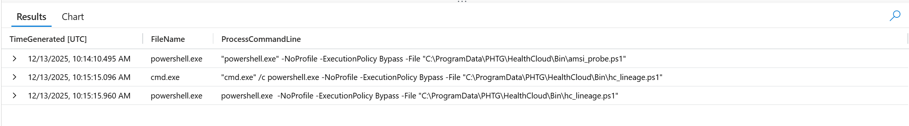

---

### 🚩 Flag 26: Custom Event Log Source Purpose

**What to find:** Flag 14 found the operator registered a custom Application event log source. What does registering this enable for the operator's tooling, and why does the operator want that?

| Field | Value |
|---|---|
| **Answer** | Registering the PHTGHealthCloud source enables the tooling to write custom entries into the Windows Application Event Log via the Event Log API, allowing its activity to blend into legitimate application telemetry and attract less scrutiny. |
| **Time (UTC)** | N/A |

**Details:** The custom PHTGHealthCloud source registered under EventLog\Application (Flag 14) lets the operator's tooling write entries into the trusted Windows Application Event Log through the Event Log API. The operator wanted this so its activity would blend in with legitimate application telemetry and draw less scrutiny from defenders.

**Query:** N/A

---

### Phase 07: Hands on the Vault

### 🚩 Flag 27: LSASS Access Anomaly

**What to find:** 16 OpenProcessApiCall events target lsass.exe in the window. Most are baseline (MsMpEng, WmiPrvSE, SenseIR, system context). One isn't. Name the account context that isn't system and the initiating process.

| Field | Value |
|---|---|
| **Answer** | vmadminusername, powershell.exe |
| **Time (UTC)** | 2025-12-13T10:14:37.2668695Z |

**Details:** Filtering OpenProcessApiCall events targeting lsass.exe on azwks-phtg-01 to exclude SYSTEM-context initiators isolated the one anomalous access among the baseline AV/system components: powershell.exe running under the vmadminusername account.

**Query:**
```kql
DeviceEvents
| where DeviceName == "azwks-phtg-01"
| where ActionType == "OpenProcessApiCall"
| where TimeGenerated between (datetime(2025-12-13T09:48:40Z) .. datetime(2025-12-13T18:00:00Z))
| where InitiatingProcessAccountName !~ "SYSTEM"
| project TimeGenerated,InitiatingProcessAccountName,InitiatingProcessFileName
| order by TimeGenerated asc
```

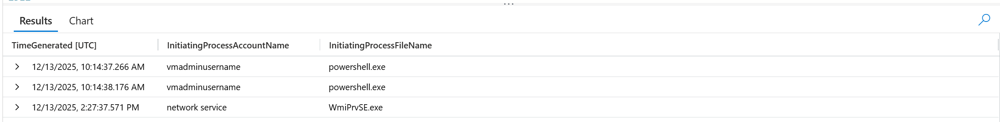

---

### 🚩 Flag 28: Access Right Escalation

**What to find:** The anomalous access to LSASS fired twice, one second apart. Look at the access mask requested. What value did the escalation end on?

| Field | Value |
|---|---|
| **Answer** | 2047999 |
| **Time (UTC)** | 2025-12-13T10:14:38.1769297Z |

**Details:** Extending the anomalous LSASS access query to surface the DesiredAccess field showed two access-mask values fired one second apart by the same powershell.exe process. The escalation between them culminated in 2047999 (0x1FFFFF, PROCESS_ALL_ACCESS), granting full access to the LSASS process.

**Query:**
```kql
DeviceEvents
| where DeviceName == "azwks-phtg-01"
| where ActionType == "OpenProcessApiCall"
| where TimeGenerated between (datetime(2025-12-13T09:48:40Z) .. datetime(2025-12-13T18:00:00Z))
| where InitiatingProcessAccountName !~ "SYSTEM"
| project TimeGenerated,InitiatingProcessAccountName,InitiatingProcessFileName, AdditionalFields.DesiredAccess
| order by TimeGenerated asc
```

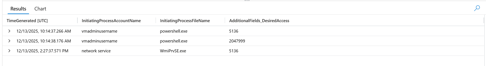

---

### 🚩 Flag 29: Credential Dump Confirmation

**What to find:** Opening a full-access handle to LSASS isn't dumping yet. What is the next ActionType you would expect if the operator actually read LSASS memory? Confirm it fired on the host.

| Field | Value |
|---|---|
| **Answer** | ReadProcessMemory |
| **Time (UTC)** | N/A |

**Details:** Following the full-access handle opened to LSASS (Flag 28), the ReadProcessMemory ActionType is the next expected step if the operator actually read LSASS memory, and it was confirmed to have fired on azwks-phtg-01, indicating credential dumping.

**Query:** N/A

---

## 🛡️ Security Recommendations

1. **Treat a success after failed-logon noise as credential reuse until proven otherwise:** Alert on the successful logon that follows failures from several regions, not on the failure volume itself, and flag an admin account authenticating from an internal source it does not normally use. Reused credentials are far more likely than brute force when the same account shows both.

2. **Detect the concealment and persistence toolkit as a set, and decode before you dismiss:** `attrib +h/+s` on staging directories, Run keys, Startup-folder shortcuts, custom event log sources under HKLM, and binaries whose file name does not match their original file name (such as a tool masquerading as bitsadmin.exe) each look like housekeeping alone. Together they describe a persistence build, and encoded PowerShell beacons should be decoded rather than assumed benign.

3. **Move from detect-only to prevention on Defender tampering and LSASS access:** Alert and block on changes under the Windows Defender Exclusions keys, including brief add-then-remove patterns, and treat a detected persistence artefact that stayed in place as a posture gap. Alert on full-access handles to lsass.exe from a non-system PowerShell process and on the memory reads that follow, since that sequence is credential dumping.
